[TOC]
## 179
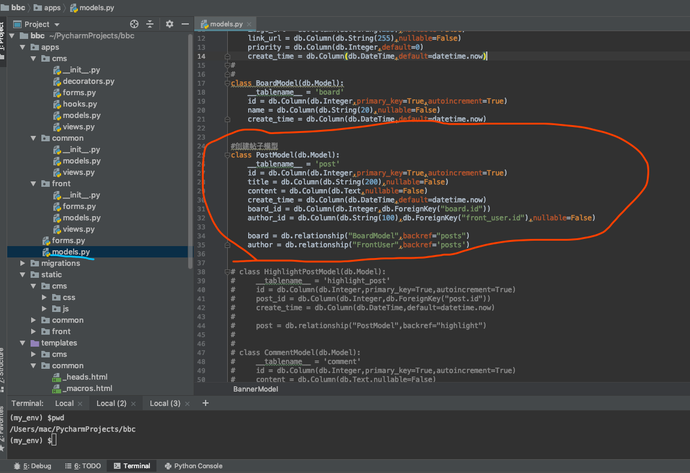

```
(my_env) $python3 manage.py db migrate
INFO [alembic.runtime.migration] Context impl MySQLImpl.
INFO [alembic.runtime.migration] Will assume non-transactional DDL.
INFO [alembic.autogenerate.compare] Detected added table 'post'
  Generating /Users/mac/PycharmProjects/bbc/migrations/versions/c5b238cda56e_.py
  ... done
(my_env) $python3 manage.py db upgrade
INFO [alembic.runtime.migration] Context impl MySQLImpl.
INFO [alembic.runtime.migration] Will assume non-transactional DDL.
INFO [alembic.runtime.migration] Running upgrade 5deacd3d34d0 -> c5b238cda56e, empty message
(my_env) $
================================================================================================================================


```


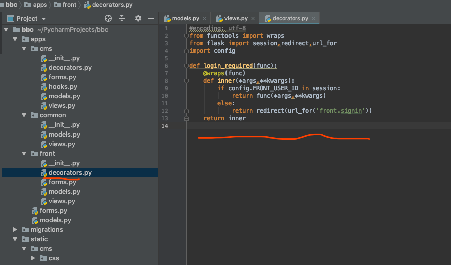

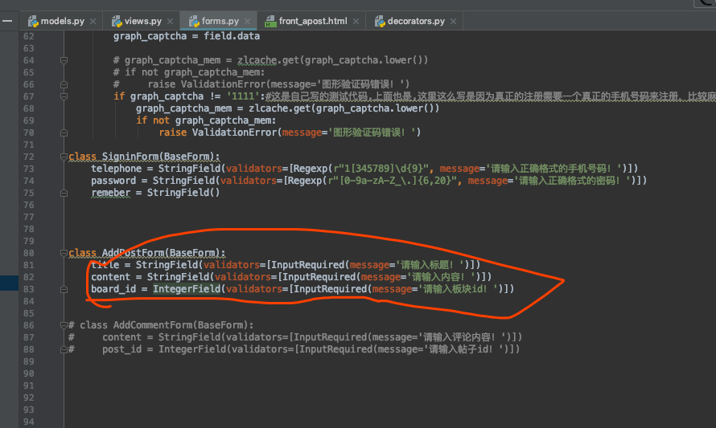


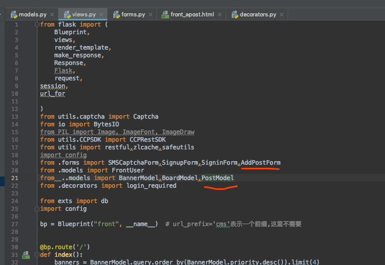

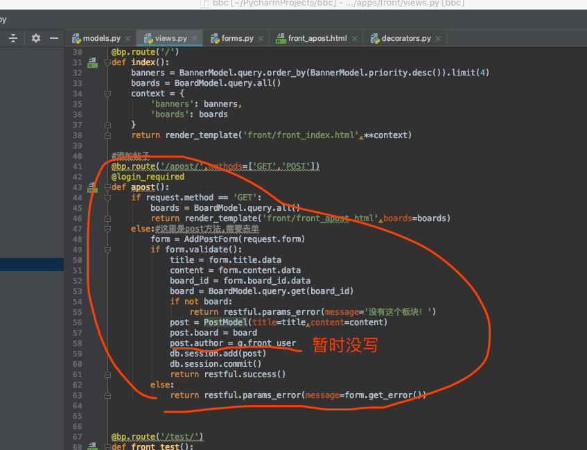

## 180
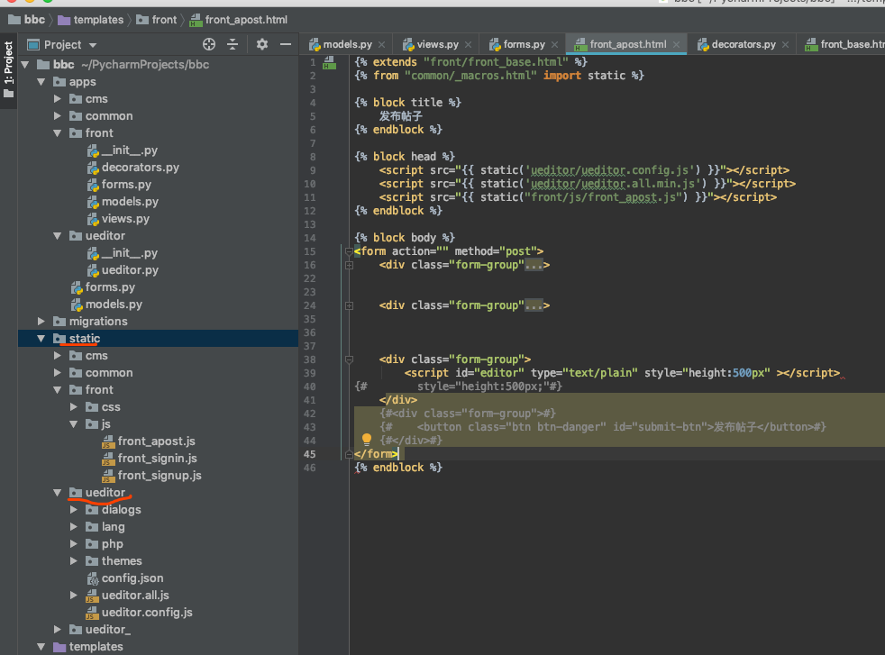


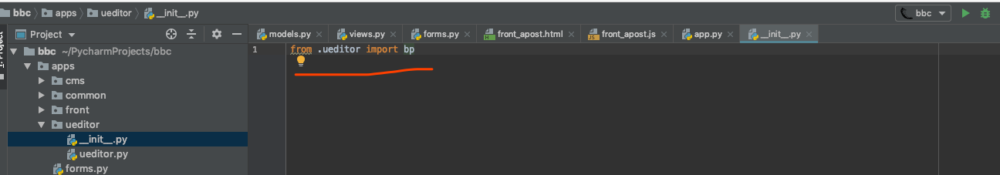


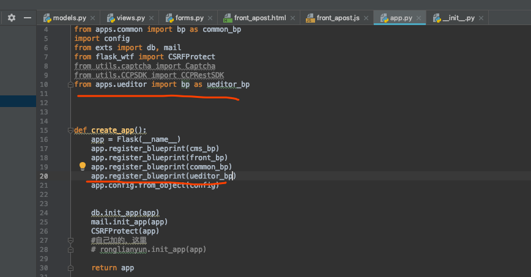

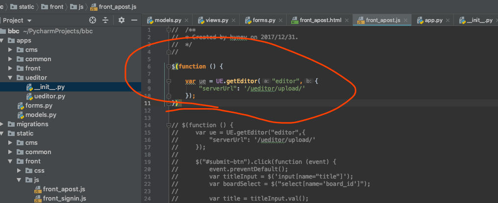

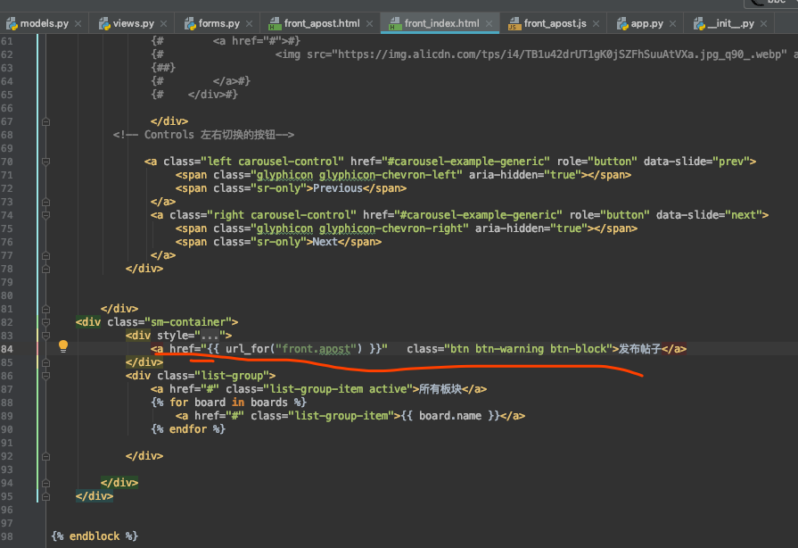
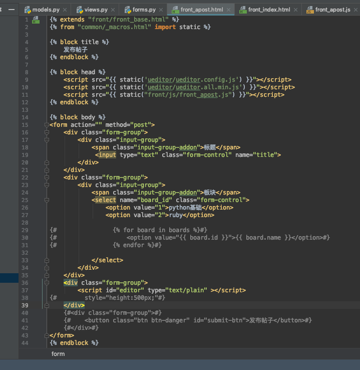
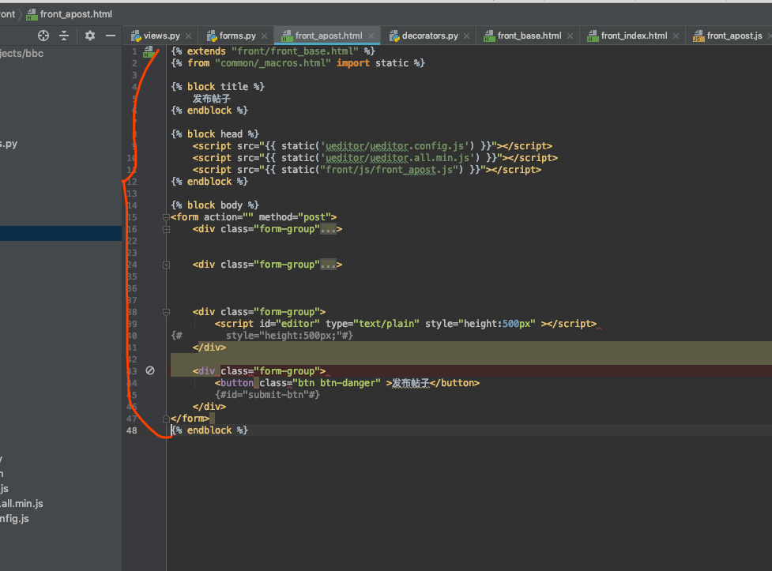

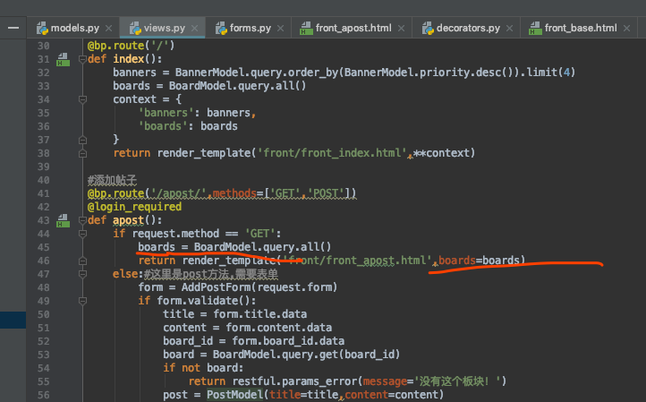
注意:copy 的时候下面这个文件夹也要一并copy过来,不然会报错!
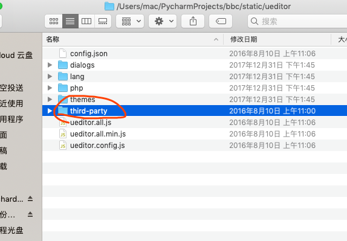

